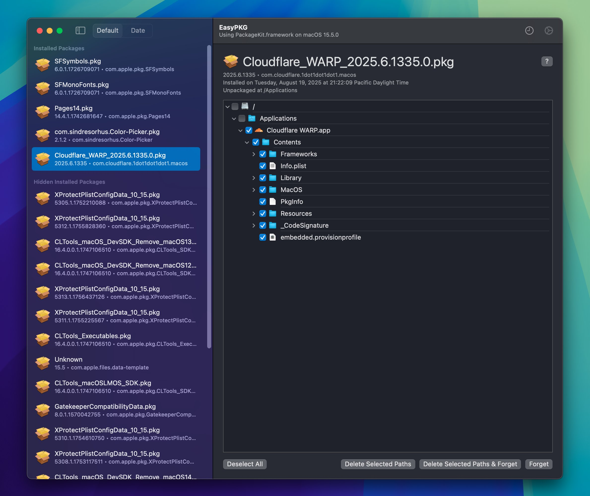

Recently I've been wanting to clean my Mac without resetting it, this usually involved me deleting some programs I didn't use or files I didn't need anymore, the usual. Though this also involved me deleting some of my brew packages and libraries I had that I no longer had a use for, when doing that I thought about how I would be able to delete some of the `.pkg` file contents on my machine.

At first, I looked into if they provided any tools to see if or what packages I have installed, and surely enough they do! It is called `pkgutil`, it seems to be pre-installed on your Mac and has some options related the `.pkg` files we've installed.

---

## The beginning

Looking at the tool, it does not seem to have any way to delete installed packages. All it contains is some database and some information commands, which I thought was strange. Why would they make a tool like this and provide no way to uninstall them?

Online, it seems to uninstall packages, *you need to do it manually*, by manually, I mean, deleting the files manually, looking at the install script to see if there's any additional files it could've pre-packaged, there's no uninstall script.

It seems that `.pkg` files are ONLY meant to be installed, for ease-of-use, and not uninstalled. Along with that, some packages like *Rosetta* NEED to be uninstalled via Recovery.

The tool itself has some important options that we can look at despite lacking some important functionality: it has a way to list packages (by their identitifer)

```sh
$ pkgutil --packages
com.apple.pkg.SFMonoFonts
com.apple.pkg.Pages14
net.shinyfrog.image2icon
com.sindresorhus.Color-Picker
com.cloudflare.1dot1dot1dot1.macos
com.apple.pkg.TransporterApp
...
```

And surprisingly, we can find out where the packages were installed to:

```sh
$ pkgutil --files com.apple.pkg.SFSymbols
Applications
Applications/SF Symbols.app
...
```

If you find this output strange, it's mainly because there's also a install location in `.pkg` files you can specify when creating them, for example *SFSymbols* here installs to the root of the drive you specified.

```sh
$ pkgutil --pkg-info com.apple.pkg.SFSymbols
package-id: com.apple.pkg.SFSymbols
version: 6.0.1.1726709071
volume: /
location: /
install-time: 175351785
```

Looking again, it seems that the tool includes *forgetting* a package, so the ONLY function you have in terms of getting rid of it, is just forgetting it existed, not even deleting the files.

Since there's a tool that can interact with the receipts and know the installed package paths, I had a stroke of genius, I wanted to make an app that shows these paths in a friendly way that allowed me to easily delete these files without having to do it manually.

## Finding PackageKit

First thing I did was look into the `pkgutil` binary itself, I ran `otool` specifically to see if it linked into any frameworks I should be aware of. This tool in particular lists me all the dynamically loaded libraries, in Apple software they can and most likely will link to private frameworks that have no documentation.

```sh
$ otool -L $(which pkgutil)
/usr/sbin/pkgutil:
	/System/Library/PrivateFrameworks/Bom.framework/Versions/A/Bom (compatibility version 2.0.0, current version 195.0.0)
	/System/Library/Frameworks/CoreFoundation.framework/Versions/A/CoreFoundation (compatibility version 150.0.0, current version 3502.0.0)
	/System/Library/Frameworks/Foundation.framework/Versions/C/Foundation (compatibility version 300.0.0, current version 3502.0.0)
	/System/Library/PrivateFrameworks/PackageKit.framework/Versions/A/PackageKit (compatibility version 1.0.0, current version 434.0.0)
	/usr/lib/libxar.1.dylib (compatibility version 1.0.0, current version 1.3.0)
	/System/Library/Frameworks/Security.framework/Versions/A/Security (compatibility version 1.0.0, current version 61439.120.27)
	/usr/lib/libobjc.A.dylib (compatibility version 1.0.0, current version 228.0.0)
	/usr/lib/libSystem.B.dylib (compatibility version 1.0.0, current version 1351.0.0)
```

We have a list, and there seems to be some frameworks here that stand out:

```
/System/Library/PrivateFrameworks/PackageKit.framework/Versions/A/PackageKit
/System/Library/PrivateFrameworks/Bom.framework/Versions/A/Bom
```

## Finding the Headers

Most of Apple's frameworks are either written in Objective-C or Swift, Objective-C takes up the majority since it's the oldest, but conveniently Objective-C exposes all of it's headers at runtime.

For our use, we can use [`runtimectl`](https://github.com/claration/runtimectl) to dynamically load these frameworks at runtime and list / dump their headers if needed.

```sh
$ runtimectl -f /System/Library/PrivateFrameworks/PackageKit.framework/Versions/A/PackageKit -l
PKTrie
PKInstallStateHelper
PKDataSizeFormatter
PKDataSizeValueTransformer
PKTimeRemainingFormatter
PKTimeRemainingValueTransformer
PKInstallClient
_PKInstallClientConnection
PKInstallDaemon
PKArchive
PKMutableArchive
PKArchiveSignature
PKExtendedAttributeEnumerator
PKArchiveSigner
PKFolderArchive
PKFolderArchiveSignature
...
```

There's a bunch of classes, a lot more than what's listed here, this is just an example of how to get these specific classes. Theres classes that stand out, like *PKInstallHistory* and *PKReceipt*, these are the classes we're going to be looking at as those were the ones used in *EasyPKG*.

We can use [`runtimectl`](https://github.com/khcrysalis/runtimectl) to dump fully readable Objective-C runtime headers, mainly for use in our project using this tool. But, of the issue is that we do not know the types, this is going to be purely guess work based off of the names.

Out of the ones we spotted, *PKInstallHistory* seemed the most interesting because an install history command was not present inside of Apple's `pkgutil`.

```sh
$ runtimectl -f /System/Library/PrivateFrameworks/PackageKit.framework/Versions/A/PackageKit -c PKInstallHistory
@class NSString;

@interface PKInstallHistory : NSObject {
    NSString *_path;
}

+ (id)defaultHistory;
+ (id)_errorWithCode:(long long)a0 posixErrno:(int)a1;
+ (id)historyOnVolume:(id)a0;

- (void)dealloc;
- (id)initWithPath:(id)a0;
- (id)installedItems;
- (BOOL)_openInstallHistoryWithItems:(id)a0 returningError:(id *)a1;
- (BOOL)_renameInstallHistoryAtDir:(int)a0 fileName:(char *)a1 returningError:(out id *)a2;
- (BOOL)addInstallRequest:(id)a0;
- (BOOL)recordInstall:(id)a0;
- (BOOL)recordInstall:(id)a0 returningError:(id *)a1;

@end
```

Conveniently, there's not many static functions here to look around at, judging by how this is structured it seems that the static functions returns an instance of itself.

```swift
print(type(of: PKInstallHistory.defaultHistory()))
// PKInstallHistory
```

Seems like I was right! It does return an instance of itself, with this instance we can call the `installedItems` function and see what the output is. Also, using the same way we found the type of the output of that previous *defaultHistory* function, we can also apply it for this other function we can now use to find the type. I won't tell you how to do it again, but just know its an array of NSDictionary's.

```swift
if
    let history = PKInstallHistory.history(onVolume: path) as? AnyObject,
    let installedItems = history.installedItems() as? [NSDictionary]
{
    print(installedItems)
    /*
    [{
        date = "2025-07-17 22:51:30 +0000";
        displayName = "macOS 15.5";
        displayVersion = "15.5";
        processName = softwareupdated;
    }, {
        contentType = "config-data";
        date = "2025-07-17 23:03:10 +0000";
        displayName = MRTConfigData;
        displayVersion = "1.93";
        packageIdentifiers =     (
            "com.apple.pkg.MRTConfigData_10_15.16U4211"
        );
        processName = softwareupdated;
    },
    ...
    */
}
```

We now have a way to list the install history for these packages! Not sure why they didn't include it in their pre-installed tool, but this is cool nevertheless.

---

Now let's look into *PKReceipt*...

```sh
$ runtimectl -f /System/Library/PrivateFrameworks/PackageKit.framework/Versions/A/PackageKit -c PKReceipt
@class NSString, NSMutableDictionary;

@interface PKReceipt : NSObject {
    NSMutableDictionary *_receiptDictionary;
    NSString *_bomPath;
    void *_cachedBOM;
    NSString *_bundlePath;
    BOOL _isSecure;
}

+ (void)_clearCache;
+ (id)receiptsAtPath:(id)a0;
+ (id)__findReceiptsFromBOMsDirectory:(id)a0;
+ (id)__findBundleReceiptsFromDirectory:(id)a0;
+ (void)_clearCacheInOtherProcesses;
+ (void)_clearCacheLocally;
+ (void)_clearCacheWithNotification:(id)a0;
+ (id)_findReceiptsOnVolumeAtPath:(id)a0;
+ (id)_receiptDictionaryPathFromBOMPath:(id)a0;
+ (id)_receiptsDirectoryPathForDestination:(id)a0;
...
```

Yeah there seems to be a lot more to this one compared to the last class we looked at, but fear not, we only need a few things from here that are important to us for finding the package install paths, though there's a lot to unpack.

More specifically, we can look at these functions, for our sake I've already done the work into finding what types they take and what types they return

```swift
let receipt = PKReceipt.receiptsOnVolume(atPath: /* String */) // returns [PKReceipt]
_ = receipt.installPrefixPath()! // return String
_ = receipt._directoryEnumerator() // returns NSEnumerator
_ = receipt.receiptStoragePaths() // returns [String]

// Remember, the compiler does not know the types unless you explicitly mark them.
```

These functions house all we need for listing all the paths we would need to delete, as previously looked at before, people are able to specify the install prefix for their package, for example if they have an app in their `.pkg` the most common prefix would be `/Applications`. Here it's a bit strange, some paths could be `Applications/` or `/Applications`, or even just nothing, due to how it was packaged. Though, you can do some stuff to fix these easily by checking the prefix and suffix, then adding the volume + prefix.

The directory enumator well, lists the contents of the directory, more specifically, this comes from the receipt's BOM file, which contains all the paths associated with the package. Which can be found by using the *receiptStoragePaths* function. This function only lists 2 entries inside of the array, which was interesting. The output can be as followed:

```
/Library/Apple/System/Library/Receipts/com.apple.pkg.MobileDevice.plist
/Library/Apple/System/Library/Receipts/com.apple.pkg.MobileDevice.bom
```

Along with this, Apple has a *PKBOM* class which can be used to initialize an instance with a custom `.bom` file path so you can read its attributes, like size, file count, file attributes, etc..

For our usecase, we won't be using this, but it's good to know whenever we want to look at a `.bom` file that isn't related to PackageKit.

With this code, we can print the same result as we would if we would be using `pkgutil --files com.apple.pkg.SFSymbols`.

```swift
let receipt = PKReceipt.receiptsOnVolume(atPath: "/") as! PKReceipt
var paths: [String] = []
// functions prefixed with `_` is considered private
// so we shouldn't be using them as they could change
// whenever, though, this is in a private framework
// anyway so not sure if this matters that much..
if let enumerator = receipt._directoryEnumerator() as? NSEnumerator {
    while let path = enumerator.nextObject() as? String {
        paths.append(path)
    }
}
print(paths)
```

We mention the volume and prefix earlier because ideally we would want to combine the volume, prefix, and these paths together so we can have something readable for swift.

Our final output should be something similar to

```
/Applications
/Applications/SF Symbols.app
```

or if you installed on another volume:

```
/Volumes/<externaldrive>/Applications
/Volumes/<externaldrive>/Applications/SF Symbols.app
```

Congratulations, we now have all the info we need to make what we want!

## Removing the paths and receipts we want

Deleting the files is simple enough, since we have a list of paths, we can just select what we need to delete and they would delete with the standard api's Apple provides.

When it comes to removing the entry from PackageKit, at first I didn't exactly know how to do it, I ended up looking aimlessly at all the headers. The last thing I tried was deleting from LaunchPad, since all App Store apps insert an entry into PackageKit automatically, we can attempt to find out how to delete this entry by just experimenting with existing tools.

If you delete an app from LaunchPad, it seems that it only deletes the files, and not an entry from the package list, while `pkgutil` does have a `--forget` flag, we don't know what it actually does.

I looked everywhere, but it seems like it purely just deletes the receiptPaths gathered from `receipt.receiptStoragePaths()`..... lovely

## EasyPKG Development

It took awhile to figure out what functions return what, or what they take in, often leading to crashes or something similar. As well as using a private framework, this can change at any time, this app may not work in a year or two and could crash on launch due to relying on these headers (or symbols) to hopefully exist in the framework, which is fine, I don't exactly plan on upgrading to anything newer anytime soon.



- You can find EasyPKG here: https://github.com/claration/EasyPKG
- You can find runtimectl here: https://github.com/claration/runtimectl
