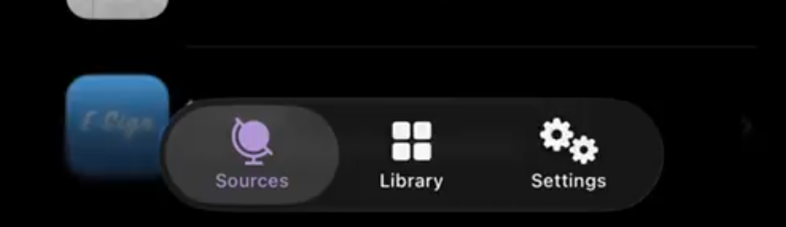
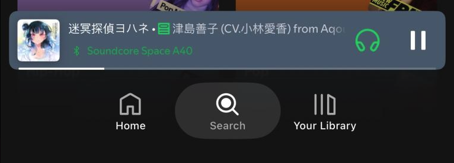
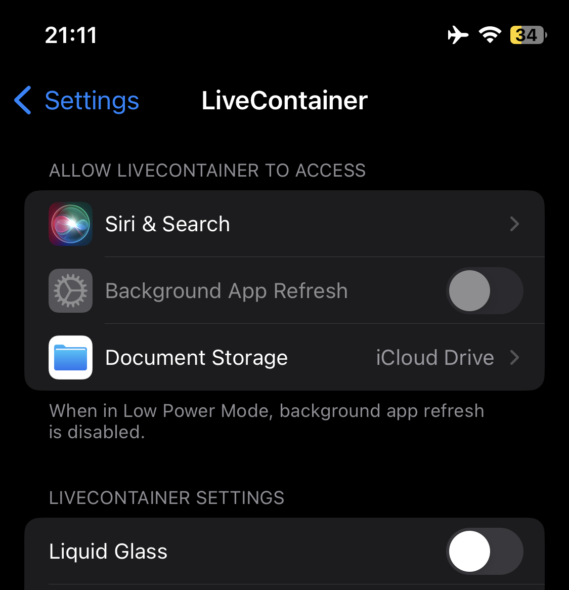

*OS 26 was something unveiled on WWDC 2026, this was the biggest feature update since iOS 7. With the introduction with Liquid Glass, it changed a way a lot of people thought about how UI should look and feel.

When it was introduced, people needed to use their beta version of Xcode to somehow "enable" Liquid Glass, which is sadly not an option for a lot of developers because they usually tend to stick to older versions of Xcode mainly for compatibility reasons. This blog should cover unusual ways of enabling Liquid Glass without a recompilation using Xcode 26.

---

Since this is a large update, we can probably expect there be some sort of kill switch on this redesign. There's some hints that they may do this because they can also switch off Apple Intelligence at any time [hinted on this article](https://www.macrumors.com/2025/06/19/apple-intelligence-down-on-ios-26-beta/).

Since the codename is `Solarium`, we can check the SwiftUI framework for any references to this.

```sh
$ strings "SwiftUICore.framework/SwiftUICore" | grep com.apple | grep Solarium
com.apple.SwiftUI.DisableSolarium
com.apple.SwiftUI.IgnoreSolariumHardwareCheck
com.apple.SwiftUI.IgnoreSolariumLinkedOnCheck
```

Oh? Seems like there's actual values within the framework referencing this, these are most likely defaults because they contain `com.apple`.

Let's do some experimentation...

---

## UserDefaults

All applications are able to save persistent settings, in Apple OS's, conveniently we have a class specifically for setting these persistent settings using [UserDefaults](https://developer.apple.com/documentation/foundation/userdefaults). We can assume these defaults are booleens, at least indicated by the names.

`com.apple.SwiftUI.IgnoreSolariumLinkedOnCheck`, lets set this to `TRUE`

UserDefaults class:

```swift
UserDefaults.standard.set(true, forKey: "com.apple.SwiftUI.IgnoreSolariumLinkedOnCheck")
```

SwiftUI:

```swift
// ContentView.swift

import SwiftUI

struct ContentView: View {
    @AppStorage("com.apple.SwiftUI.IgnoreSolariumLinkedOnCheck")
    private var _liquidGlass: Bool = false

    var body: some View {
        List {
            // Once toggling, this requires a restart of the app
            Toggle("Enable Liquid Glass", isOn: $_liquidGlass)
        }
    }
}
```

This require a restart of the application, you can do this by either force closing the app in the app switcher or doing it programmatically.

Seems like it worked after restarting!



---

## UserDefaults (Global)

In addition to the app userdefault for ignoring the solarium check, there's also *global* defaults. Though there's a caveat, on iOS, you can't set this programmatically, rather you will need to set this manually yourself or using some external tool, but this is also a protected path that apps cannot access normally (at least on iOS)

### iOS

On iOS, the global defaults can be found at:

`/private/var/mobile/.GlobalPreferences.plist`

We can set this key (bool)

`com.apple.SwiftUI.DisableSolarium`, set to `TRUE`

For using an external tool (for example, backup modifications to write to normally inaccessible paths) we can forcefully write the file using these contents:

```xml
// .GlobalPreferences.plist

<?xml version="1.0" encoding="UTF-8"?>
<!DOCTYPE plist PUBLIC "-//Apple//DTD PLIST 1.0//EN" "http://www.apple.com/DTDs/PropertyList-1.0.dtd">
<plist version="1.0">
<dict>
	<key>com.apple.SwiftUI.DisableSolarium</key>
	<true/>
</dict>
</plist>
```

### macOS

On macOS, disabling Liquid Glass globally is as simple as a simple terminal command:

```sh
defaults write -g com.apple.SwiftUI.DisableSolarium -bool TRUE
```

---

## Patching

There are times where you want to do this with an app that is out of your control, often times not wanting to mess with global settings.

You may have noticed that Apple has mentioned that you will need to compile with Xcode 26 to be able to get Liquid Glass, but in reality it's using the *OS 26 SDK. When compiling a program successfully, there's a header set in the binary (machO) which contains which SDK version it was compiled with, and considering the name of this default "com.apple.SwiftUI.IgnoreSolariumLinkedOnCheck" it implies it most likely checks this value in the binary header to see if it should use the new redesign.

<!-- we should add credit to DUY, nyathea, little -->

Now that we know what it checks, couldn't we just modify this value? Surely this is the way it determines if the app should use the new appearance.

Let's see, conveniently Xcode comes with a tool that lets you modify some of the headers in binaries, we can use this command to forcefully change the values in these headers

```sh
vtool -arch arm64 -set-build-version \
    2 12.0 26.0 -replace \
    -output <out_bin> <orig_bin>
# (2) platform, (12.0) minos, (26.0) sdk
```

This also seems to work! Here's Spotify patched with this simple motification, the tabbar changed to use the new redesign.



---

## Adding a Settings.bundle

Alternatively to patching, we can add a bundle to the app so the user can change the userdefaults without the need of doing it programmatically. In the documentation about [Settings.bundle](https://developer.apple.com/library/archive/documentation/Cocoa/Conceptual/UserDefaults/Preferences/Preferences.html), this lets users manage defaults, though through settings instead of the app itself. Conveniently. Similar to our Swift code above, we can also modify the "com.apple.SwiftUI.IgnoreSolariumLinkedOnCheck" value within this.

Add this dictionary to the bundle of the app you're modifying, if the Settings.bundle doesn't exist, learn to make one so you can do this yourself. Here are the proper keys so you can enable the settings without the need of patching the app:

```xml
// Root.plist
...
<array>
    <dict>
        <key>Type</key>
        <string>PSToggleSwitchSpecifier</string>
        <key>Title</key>
        <string>Liquid Glass</string>
        <key>Key</key>
        <string>com.apple.SwiftUI.IgnoreSolariumLinkedOnCheck</string>
        <key>DefaultValue</key>
        <false/>
    </dict>
...
```

It is now here in settings!



---

# Credits
- [Duy Tran](https://x.com/khanhduytran0) - Showing where to find the settings.
- [Thea](https://x.com/nyaathea) - Discovering the initial setting.
- [Little_34306](https://x.com/Little_34306) - Showing that you can do this on iOS.
