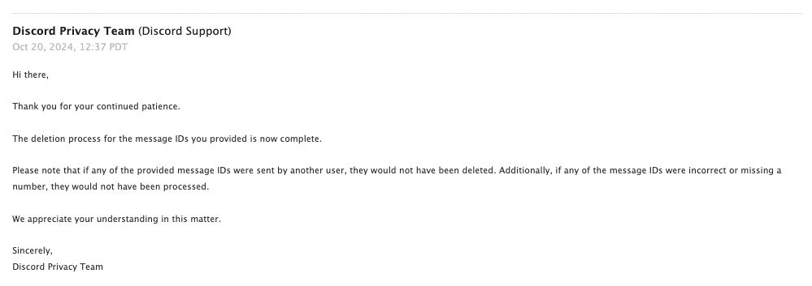

##### NOTE
This post is outdated - now Discord requires a CSV file instead of a plain text file with the ID's, the python scripts to obtain said message ID's should be able to provide this CSV file.

Additional note, recently Discord added an arbitrary limitation on how and when you would delete messages - implying that they only delete messages if the "spaces" (channels) are private and you cannot access them. However, theres been some cases where Discord removes these messages anyways if the emails are "threatening" enough.

---

Short Answer: **Yes, they can. However, there are some hoops you have to go through to actually achieve this.**

### Why This Works and Why It Isnt Restricted to the EU

Certain countries have strict regulations that require companies to allow users to delete their data upon request. While Discord might not comply based on your location, it is generally easier for them to follow the requests than to investigate each one individually as its generally a waste of human resources.

I myself and many others from America have successfully had their request go through to start the bulk deletion process, all you really need to do is make it seem like you're from the EU. Nothing more and nothing less.

### The Old Way

The old way involved using some external software that automate your account to automatically delete messages, this has some risk to get your account terminated as selfbots are heavily moderated. This was generally not something you should ever use if you want to keep your account intact, while there are some cases where your account was safe after using, this is not guarenteed.

### Restrictions

Note that if any of the provided message IDs were sent by another user (i.e. you snuck in an ID of a friend), they would not have been deleted. Additionally, if any of the message IDs were incorrect or missing a number, they will not be processed and will not be deleted.

They will also not process deletion request for messages associated with a deleted account, unless it has any identifiable information from you or another friend of yours. They will tell you this in email when starting the deletion process.

---

This part of the blog will show you how to successfully* delete your messages within given channels/dms, without risking your account and by using Discord's built-in systems.

## Prerequisites

- You **need** your Data Package for Discord to delete all your messages within a given channel, you can request this from Discord by going to

  `Settings > Privacy & Safety > Request Data` and selecting **Messages**.

  This will take a few days to process depending on your total messgae count in general, however this is nothing to worry about.

- You will also need the [bulk deletion helper](https://github.com/ishnz/bulk_deletion_helper) to obtain all message IDs you want to delete within a given channel. You can obtain this by running

  ```sh
  git clone https://github.com/ishnz/bulk_deletion_helper
  ```

## Obtaining Your Messages

You've gotten your Data Package contained in a zip file and you have the repository cloned on your machine, great! We will now attempt to obtain all messages IDs you want to delete from your Data Package.

- Make sure you have [Python](https://www.python.org/downloads/) installed
- Unzip the data package for discord and drag the messages directory to your clone of the bulk_deletion_helper

  ```diff
    bulk_deletion_helper
    ├── README.md
    ├── blacklistdumpchannelids.py
    ├── dumpallmessages.py
    ├── dumpchannelids.py
    ├── dumpmessagesbyyear.py
    ├── getchannelidsbyservers.py
  + └── messages

  ```

- Run the appropriate script for the messages you want to delete

  ```sh
  python3 /path/to/script.py
  ```

  As you can see there's many python files you can run, to see how you can use the files see [this](https://github.com/ishnz/bulk_deletion_helper?tab=readme-ov-file#behavior-of-scripts)

Once finished, you will get a new file in your cloned directory called `messages.txt`, here are some example contents on how it would look like:

```
1000481031113166949:
1180969226970857572

1011046338621874296:
1011047610016075859, 1011047290473021492,
1011047180263510096, 1011046825924509766,
1011046698765783150, 1011046565089132584

1007684772979544124:
1009602140307726406
```

## Making a Request

We will make a request to [Discord Privacy](https://support.discord.com/hc/en-us/requests/new?ticket_form_id=4750383925911), you will also choose that you want to delete your personal data.

Submit neccessary details, including the information (such as.. Email, Username) that is associated to your Discord account you want to delete messages for.

##### Subject
```
Bulk Removal of Messages - <your_username>
```

##### Description
```
Hello,

I am formally requesting the deletion of all my messages in the attached text document in compliance with GDPR. The attachment contains the list in the required format as it is too large for a single email.

While I understand there's concerns about context, my privacy is vastly more important. I would delete these messages myself but I do not have access to this server anymore and Discord doesn't seem concerned with letting users properly manage their own data, especially on such a large scale.

Thank you.
```

##### What do you need assistance with?

```
Delete your personal data on Discord
```

##### Attachments

Drop your text file containing the IDs you want to delete, with the script we have `messages.txt`

## Conclusion

After submitting your request, it may take some time for Discord to respond and begin deleting your messages. In some cases, users have had to follow up multiple times within the support ticket to ensure the bulk deletion process is initiated.

I've done this request myself and it has been successful, though for me it took around 44~ days to fully process my request as my text file was around 19mb with over 600,000 messages.

##### My Email



---

## Links
- [Privacy Discussion](https://github.com/victornpb/undiscord/discussions/429)
- [Bulk Deletion Helper](https://github.com/ishnz/bulk_deletion_helper)
- [Report Template](https://github.com/victornpb/undiscord/discussions/429#discussioncomment-10312129)
- [Contact Discord Privacy](https://support.discord.com/hc/en-us/requests/new?ticket_form_id=4750383925911)
- [Video Guide](https://youtu.be/g5FbRfwMEuo?si=6vnAc3fdRUsagrTQ&t=418)
